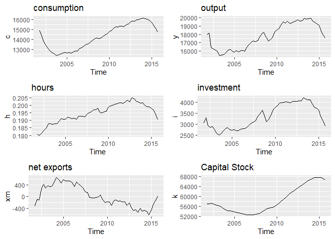
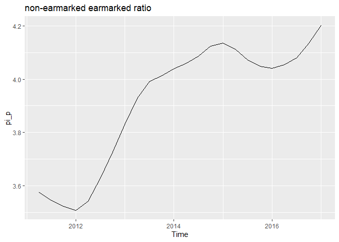

Credit Model Calibration
================
Denise Manfredini
07/02/2020

## Measured by Components of Demand

# Labor and Capital Markets

## Employment and Hours of Work

Population is divided between PIA and PINA PIA (eng:AP) is divided
between PEA and PNEA PEA (eng:EAP) is divided between employed and
unemployed

# Credit Market

## Monthly (%p.m) start in March 2011

# Adjusting to real values

## Deflate series

The series are deflated using the IPCA

## Adjust series to 2001 Q4

## Deseasonalize series and divide by population

## HP filter

# Population and Technology Discount Factors

    ##           eta    gamma
    ## [1,] 1.002411 1.004923

    ##      [,1] [,2]
    ## [1,] 0.19  0.8

## Discount factor

    ## [1] 0.92

# Final Calibration

All series are expressed in per capita terms after dividing by the
population in active age, those aged 15 to 64.

The measure of GDP is the current price GDP from the CNT/IBGE deflated
by the IPCA

capital stock: Measure using *perpetual inventory* method, using the s
data on investment, an initial capital stock, and an estimate of the
rate of depreciation we constructed a series using the accumulation
equation for capital.

*The initial value is the same measure by Lama (2011), but the ratios
are VERY different*

The measure of consumption is the sum of consumption and government
spending from CNT/IBGE

Investment is measured as the gross fixed capital formation from
CNT/IBGE

Total hours is measured by the fraction of hours worked by the AP
population. Fraction of employed population is the proportion of
employed population to total population in active
age.

## Real data in Levels (deseasonalized data)

<!-- -->

## Table in logs

    ##                 2011     2015
    ## consumption 9.636931 9.600179
    ## investment  8.288929 7.975681
    ## output      9.871980 9.772580

# Policy design

<!-- -->

    ##      [,1] [,2]
    ## [1,] 4.57 3.38
