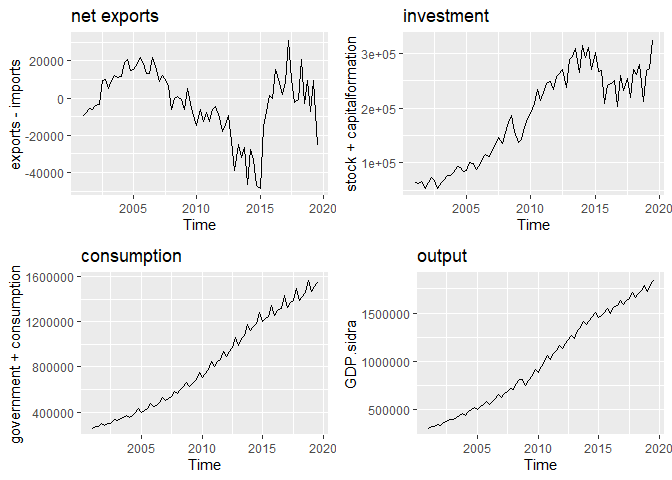
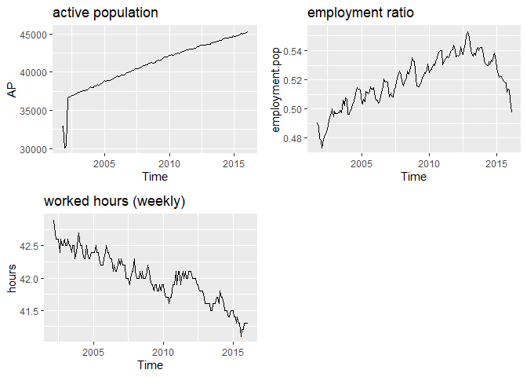
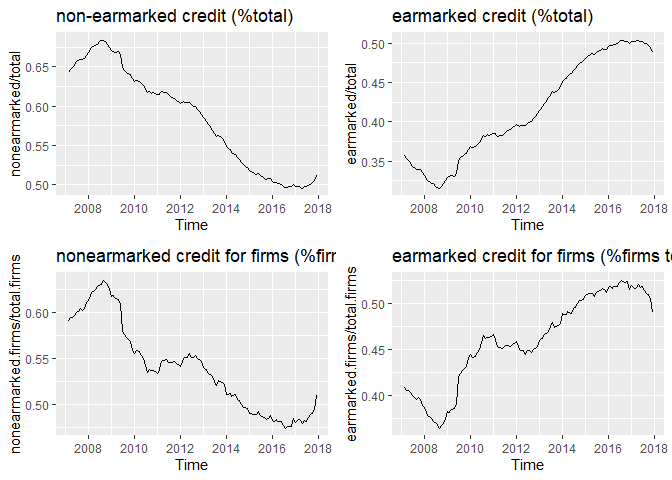
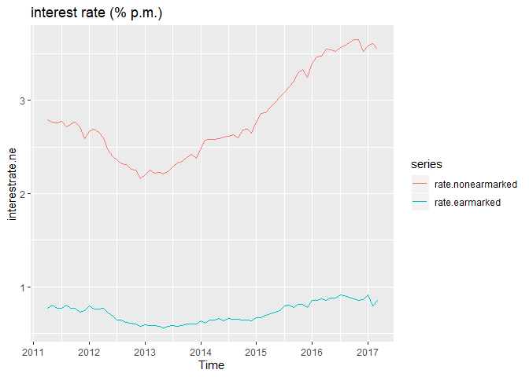
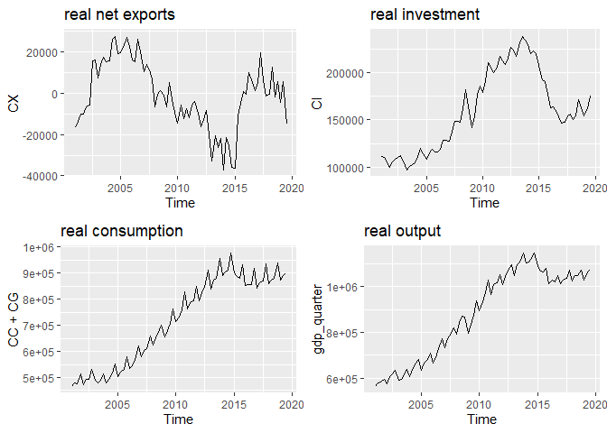

Credit Model Calibration
================
Denise Manfredini
07/02/2020

Data for the transiiton path calibration.

## GDP Measured by Components of Demand

<details>

<summary>Click to
expand</summary>

<!-- -->

</details>

# Labor and Capital Markets

## Employment and Hours of Work

``` diff
+ Population is divided between PIA and PINA.
+ PIA (eng:AP) is divided between PEA and PNEA.
+ PEA (eng:EAP) is divided between employed and unemployed.
```

<!-- -->

## Credit Market

<!-- -->

## Monthly (%p.m.) start in March 2011

<!-- -->

<details>

<summary>Click to
    expand</summary>

    ## Saving 7 x 5 in image

    ## Don't know how to automatically pick scale for object of type ts. Defaulting to continuous.
    ## Don't know how to automatically pick scale for object of type ts. Defaulting to continuous.
    ## Don't know how to automatically pick scale for object of type ts. Defaulting to continuous.

<!-- -->

</details>

# Adjusting to real values

## Deflate series

The series are deflated using the IPCA

<details>

<summary>Click to
expand</summary>

<!-- -->

</details>

## Per capita and HP filter Series

<!-- -->

# Population and Technology Discount Factors

*Gamma* is the tecnology discount factor.

*Eta* is the population discount factor.

    ##           eta    gamma
    ## [1,] 1.002411 1.004923

    ##       i/y c/y
    ## [1,] 0.19 0.8

## Discount factor

*Beta* is the discount factor.

    ## [1] 0.92

# Final Calibration

All series are expressed in per capita terms after dividing by the
population in active age, those aged 15 to 64.

The measure of **GDP** is the current price GDP from the CNT/IBGE
deflated by the IPCA

    ##      mean   sd
    ## [1,] 9.93 0.16

The **capital stock** is measure using *perpetual inventory* method,
using the s data on investment, an initial capital stock, and an
estimate of the rate of depreciation we constructed a series using the
accumulation equation for
capital.

``` diff
+ The initial value is the same measure by Lama (2011), but the ratios are VERY different.
```

    ##       mean sd  
    ## [1,] 11.11  0 2

The measure of **consumption** is the sum of consumption and government
spending from CNT/IBGE.

    ##      mean   sd
    ## [1,] 9.71 0.16

**Investment** is measured as the gross fixed capital formation from
CNT/IBGE.

    ##      mean   sd
    ## [1,] 8.25 0.23

**Total hours worked** is measured by the fraction of hours worked by
the AP population. Fraction of employed population is the proportion of
employed population to total. population in active age.

    ##         mean       sd
    ## [1,] 7999489 801217.4

## Real data in Levels (deseasonalized data)

``` diff
+  Detrended by the rate of technological progress (gamma).
```

<!-- -->

## Graphs (introduction)

<details>

<summary>Click to
    expand</summary>

    ## Saving 7 x 5 in image

    ## Don't know how to automatically pick scale for object of type ts. Defaulting to continuous.

    ## Saving 7 x 5 in image

    ## Don't know how to automatically pick scale for object of type ts. Defaulting to continuous.

    ## Saving 7 x 5 in image

    ## Don't know how to automatically pick scale for object of type ts. Defaulting to continuous.
    ## Don't know how to automatically pick scale for object of type ts. Defaulting to continuous.
    ## Don't know how to automatically pick scale for object of type ts. Defaulting to continuous.
    ## Don't know how to automatically pick scale for object of type ts. Defaulting to continuous.

<!-- -->

</details>

## Data in logs

    ##                 2011     2015
    ## consumption 9.636931 9.600179
    ## investment  8.288929 7.975681
    ## output      9.871980 9.772580

# Policy design

The transition path will be computed as a transition from the minimum
non-earmarked earmarked ration gap to the
maximum.

<!-- -->

    ##      max  min
    ## [1,] 4.2 3.51
